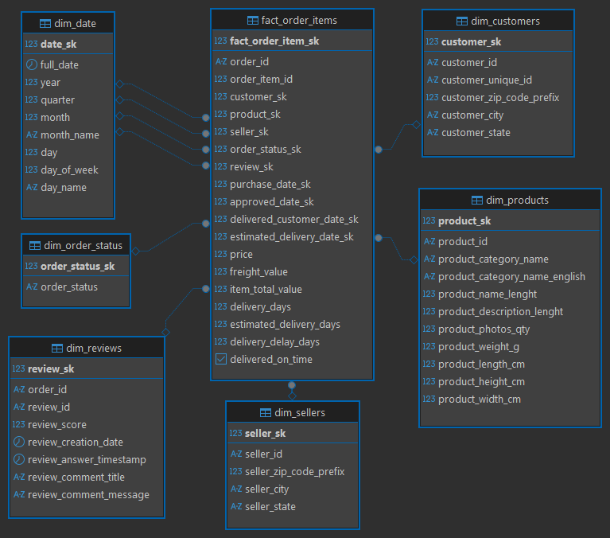
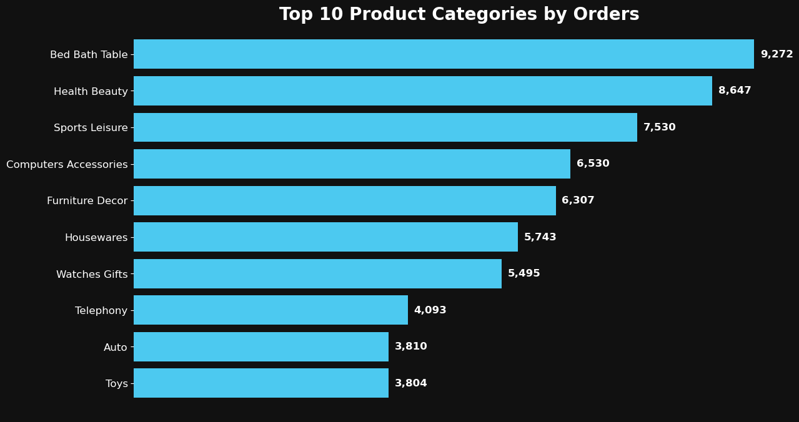
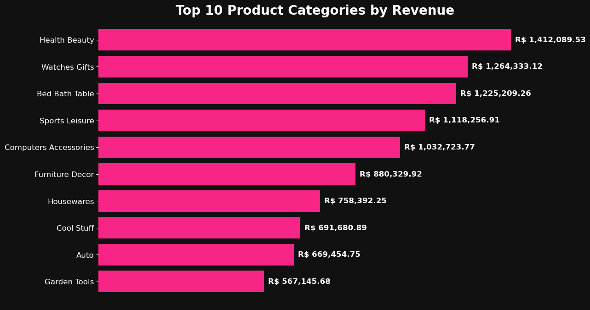
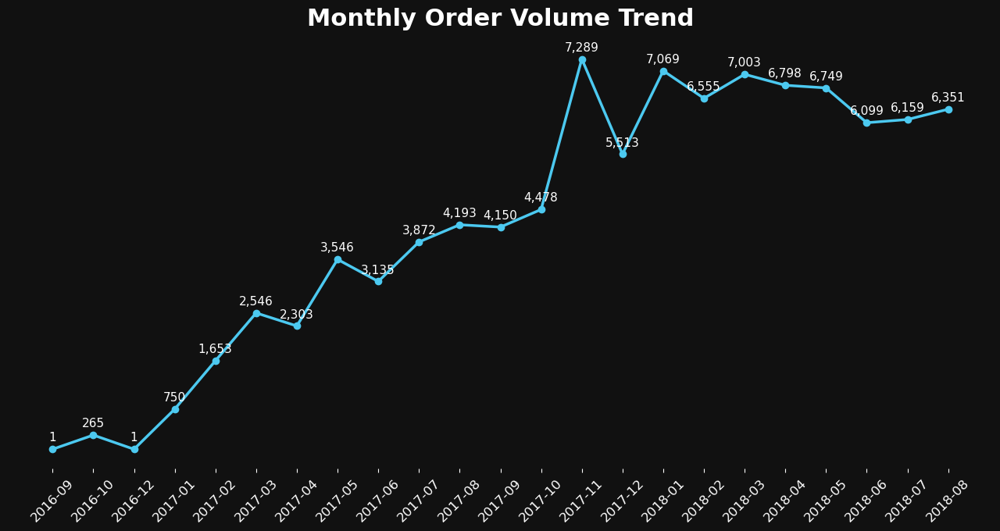
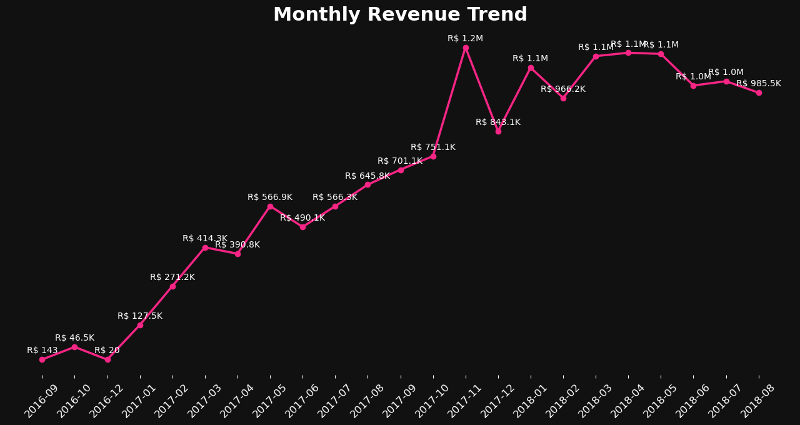
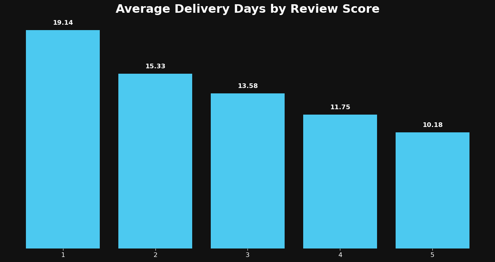
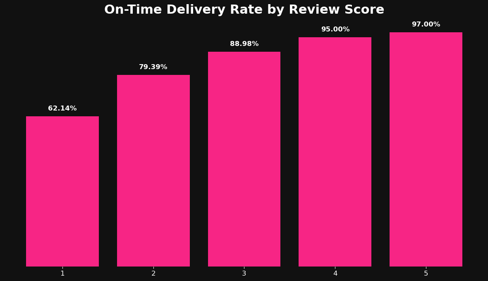

# 📊 E-commerce Sales, Delivery, and Customer Satisfaction: End-to-End Analytics Project

An end-to-end e-commerce analytics project built with Python, PostgreSQL, and data visualization to analyze category performance, sales trends, and the relationship between delivery performance and customer satisfaction.

## 📋 Table of Contents

1. [Overview](#overview)
2. [Business Problem](#business-problem)
3. [Tools & Technologies](#tools--technologies)
4. [Dataset](#dataset)
5. [Project Workflow](#project-workflow)
6. [Data Model](#data-model)
7. [Key Questions & Insights](#key-questions--insights)
8. [Repository Structure](#repository-structure)
9. [How to Reproduce](#how-to-reproduce)

## 🚀 Overview

This project analyzes a Brazilian e-commerce marketplace dataset to uncover insights into product category performance, monthly sales trends, and the impact of delivery performance on customer satisfaction.

The workflow covers the full analytics process: data inspection and cleaning in Python, data modeling in PostgreSQL using a star schema, SQL analysis to answer key business questions, and Python visualizations to present the findings.

The project is designed as a portfolio case study for a small-to-mid-sized e-commerce business that wants to improve commercial performance and customer experience through data-driven decision-making.

## 🎯 Business Problem

E-commerce businesses need to understand which product categories drive revenue, how sales performance changes over time, and how operational factors such as delivery performance influence customer satisfaction.

This project addresses those needs by analyzing delivered orders, category-level performance, monthly sales trends, and delivery-related customer experience metrics. The goal is to turn raw marketplace data into practical business insights that can support better commercial and operational decisions.

## 🛠️ Tools & Technologies

- **Python** — data inspection, cleaning, and visualization  
- **Pandas** — data transformation and preparation  
- **PostgreSQL** — staging, data modeling, and analysis queries  
- **pgAdmin 4** — database creation and table management  
- **DBeaver** — SQL analysis and query execution  
- **Jupyter Notebook** — Python workflow and visualization development  
- **Matplotlib** — custom data visualizations  
- **Kaggle** — dataset source

## 📦 Dataset

This project uses the [**Brazilian E-Commerce Public Dataset by Olist**](https://www.kaggle.com/datasets/olistbr/brazilian-ecommerce), available on Kaggle.

The dataset includes information about:
- customers
- orders
- order items
- payments
- reviews
- products
- sellers
- geolocation
- category name translation

It provides a strong foundation for analyzing marketplace sales performance, delivery operations, and customer satisfaction.

> Raw, processed, and analysis-output CSV files are not included in this repository. The original dataset can be downloaded from [Kaggle](https://www.kaggle.com/datasets/olistbr/brazilian-ecommerce) and placed into the `Dataset/Raw/` folder to reproduce the project.

> The monetary values in the dataset are in Brazilian real (BRL).

## 🔄 Project Workflow

1. Inspected the raw Olist dataset in Python  
2. Cleaned and prepared the data in the Python workflow  
3. Exported cleaned tables for database loading  
4. Loaded the cleaned data into PostgreSQL staging tables  
5. Built a star schema in PostgreSQL for analysis  
6. Wrote SQL queries to answer key business questions  
7. Created Python visualizations to present the findings

## 🧩 Data Model

The project uses a **star schema** in PostgreSQL to support category analysis, sales trend analysis, and delivery-performance analysis.

The warehouse is centered around a `fact_order_items` table, connected to the following dimensions:
- `dim_customers`
- `dim_products`
- `dim_sellers`
- `dim_order_status`
- `dim_reviews`
- `dim_date`

This structure makes it easier to analyze revenue, order volume, delivery performance, and customer review behavior efficiently.



## 📈 Key Questions & Insights

### 1. Which product categories generate the most orders and revenue?





**Insight:**  
Bed Bath Table generated the highest number of delivered orders, while Health Beauty generated the highest delivered revenue. This shows that the highest-volume categories are not always the highest-revenue categories, which is important for category planning and commercial strategy.

**Suggested recommendation:**  
Apply category-specific strategies. High-order categories may benefit from stronger inventory planning and operational efficiency, while high-revenue categories may deserve more focused pricing, promotion, and merchandising efforts.

---

### 2. How do sales and order volume change over time?





**Insight:**  
Delivered order volume and revenue grew strongly throughout 2017, peaked in November 2017, and remained consistently high during 2018. This suggests both marketplace growth and strong seasonality around late-year demand periods.

**Suggested recommendation:**  
Prepare for seasonal demand peaks with better forecasting, inventory planning, and marketing coordination. Periods of strong growth should also be monitored closely to ensure operational capacity keeps pace with sales expansion.

---

### 3. How does delivery performance affect customer review scores?





**Insight:**  
Customer satisfaction improves as delivery performance improves. Orders with higher review scores were delivered faster and had much higher on-time delivery rates, while lower-rated orders were associated with longer delivery times and weaker delivery performance.

**Suggested recommendation:**  
Treat delivery performance as a key customer experience driver. Businesses should monitor slower deliveries, investigate the causes of weaker delivery performance, and prioritize logistics improvements to support stronger customer satisfaction.

## 📁 Repository Structure

```text
E-commerce-Sales-Delivery-and-Customer-Satisfaction/
│
├── Assets/
│   ├── Q1_top_categories_vis/
│   ├── Q2_sales_trend_vis/
│   ├── Q3_delivery_vs_reviews_vis/
│   └── warehouse_star_schema.png
│
├── Dataset/
│   ├── Analysis_Outputs/
│   ├── Processed/
│   └── Raw/
│
├── Python/
│   ├── inspection_cleaning.ipynb
│   ├── Q1_top_categories_visualization.ipynb
│   ├── Q2_sales_trend_visualization.ipynb
│   └── Q3_delivery_vs_reviews_visualization.ipynb
│
├── SQL/
│   ├── Analysis/
│   └── Setup/
│
├── .gitignore
└── README.md
```

CSV files are excluded from the repository and can be regenerated by following the project workflow.

## ▶️ How to Reproduce

1. Download the [**Brazilian E-Commerce Public Dataset by Olist**](https://www.kaggle.com/datasets/olistbr/brazilian-ecommerce) from Kaggle.  
2. Place the raw CSV files into the `Dataset/Raw/` folder.  
3. Run `Python/inspection_cleaning.ipynb` to inspect, clean, and export the processed tables.  
4. Create the PostgreSQL database and run the SQL scripts in `SQL/Setup/` in order.  
5. Connect to the database in DBeaver and run the SQL analysis scripts in `SQL/Analysis/`.  
6. Export the analysis query outputs to the `Dataset/Analysis_Outputs/` folders.  
7. Run the visualization notebooks in `Python/` to generate the final charts.